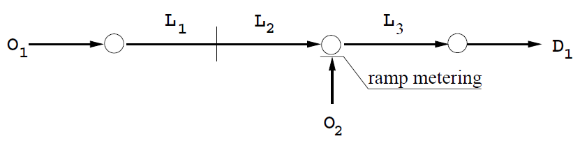

# Highway Traffic Control with MPC-based RL
Repository for an MPC-based RL framework to tackle the learning control problem for a highway traffic control application. 

---
## Problem
### Definition
The task is to find the optimal control policy for the following small highway stretch. 

The available control action is the incoming flow entering the highway from the ramp (via ramp metering). The goal is to control the flow in such a way to minimize the average time spent traversing the network, while avoiding constraint violation on the length of the ramp queue.

### Methodology
To learn this policy, an MPC controller is used as policy provider (i.e., function approximation), while an RL agent is tasked with tuning the controller's parameters to achieve optimal performance. 

---
## Repository
### Structure
The repository is structured in the following way
- `imgs`: contains images related to the application.
- `src`: this folder contains the actual Matlab files used in solving the problem at hand
    - `+METANET`: contains functions and class to simulate the highway environment according to the well-known METANET modeling framework
    - `+MPC`: contains functions and class to instantiate and run a nonlinear MPC controller 
    - `+RL`: contains functions and classes to instantiate different RL agents
    - `+util`: contains all the utility functions for, e.g., logging, plotting during training, etc..
    - `trainDPG.m`: TODO
    - `trainQL.m`: trains a Q learning agent 
    - `valid.m`: runs a validation session for multiple agents

---
## Author
Filippo Airaldi [filippoairaldi@gmail.com | f.airaldi@tudelft.nl]
